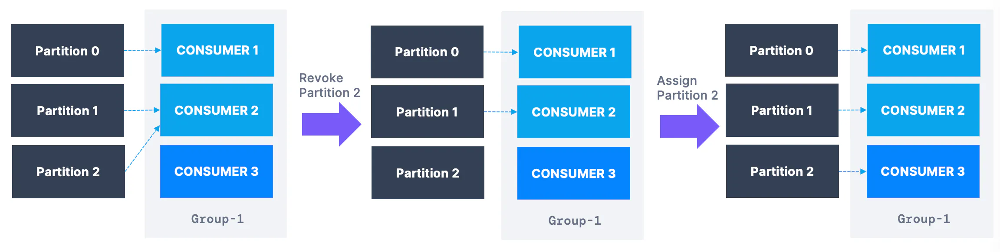

# ConsumerGroup | Java
Bu bolumde consumer group un cluster icindeki davranisini gozlemleyecegiz. Bunun icin `IntelliJ IDEA` uzerinde bir konfigurasyon yapalim. Bu sayede birden fazla terminal calistirabiliyor olacagiz.

1. Edit Configurations > Modify Options

2. Allow multiple instances

**Not:** 
 `log.info("Polling");` (68.satir) kismini terminalde fazla gurultu yapmamasi icin yorum satiri yapacagiz.

## Senaryo
Kafka cluster da bir topic icin consumer olusturuldugunda Kafka bunu default olarak bir **ConsumerGroup** icerisine alir. 
- Iki farkli consumer calistirdigimizda olusan partition assignment i terminal output uzerinde gozlemle.
- ucuncu bir consumer daha calistirip Conduktor console uzerinde consumergroup sekmesinden assignment i gozle.
- ProducerDemoWithKeys dosyasini calistirarak Kafkaya veri gonder.
- Terminal uzerinden consumer lara gelen verileri gozle.
- sizce 4. consumer calissa nasil bir etki olur?
- consumer lardan birini oldur ve rebalancing i terminal uzerinde gozle. (mevcut 2 adet consumer)
- tekrar `ProducerDemoWithKeys` i calistir. consumergroup lar uzerindeki yeni yuk dagilimini gozle

### eager rebalance
Bir topic icin sisteme farkli bir consumer geldiginde default olarak **eager rebalance** stratejisi Kafka tarafindan calistirilir. Bu durumda:
- tum consumer lar assign olduklari partition lardan baglantilarini keserler
- topicte bulunan partition lara gore yeni durumdaki consumer lar tekrar partition lara baglanir ve calisirlar.
- bu esnada - (kisa sureligine) tum consumerlar calismalarini durdurmus olurlar.
- yeni durum eski durumdaki assignment tan **farkli olabilir**.

### cooperative rebalance - incremental rebalance

- Bu strateji Kafka da yeni bir ozelliktir.
- partition larin sadece bir bolumu calismayi birakir.
- yeni durumla ilgisi bulunmayan consumer lar calismaya devam ederler.
- rebalance islemi bir kac dongu icinde sonuclanabilir. bu yuzden `incremental` diye isimlendirilir.

### Static Group Membership

Bir consumer topic e eklendiginde/cikarildiginda rebalancing trigger edilir. Ancak bazi durumlarda rebalancing yapilmasini istemeyebiliriz. Bunun icin:

- consumer a `group.instance.id` degeri verilir. Ve bu deger consumer i statik yapar.
- bosta kalan partitionlar ancak `session.timeout.ms` suresince beklerler.
- bu surede gecmeden ayni `group.instance.id` e sahip consumer a baglanabilirler.
- `session.timeout.ms` suresi bitince rebalance islemi yapilir.
- Kubernetes gibi ortamlarda verimlilik saglar.

### Consumer Auto Offset Commit Behaviour

Default olarak consumer lar okuduklari offset leri **duzenli** ve **otomatik** olarak **Kafka Broker** a bildirirler.

`enable.auto.commit=true` ve `auto.commit.interval.ms` degerlerine goz atin.

Offsetlerin işlenmesi, `poll()` işlevi çağrıldığında ve .poll() işlevine yapılan iki çağrı arasındaki süre `auto.commit.interval.ms` ayarından (varsayılan olarak 5 saniye) büyük olduğunda gerçekleşir.

### Kaynak

https://www.conduktor.io/kafka/consumer-incremental-rebalance-and-static-group-membership/

https://kafka.apache.org/documentation/#consumerconfigs  (find the `partition.assignment.strategy`)

https://kafka.apache.org/36/documentation/#static_membership

https://www.conduktor.io/kafka/complete-kafka-consumer-with-java/