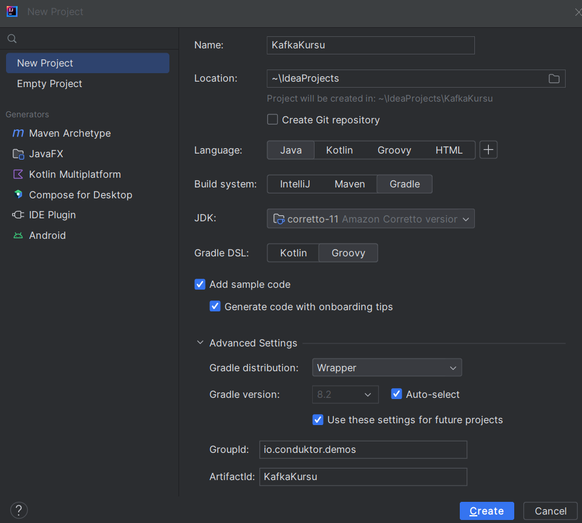
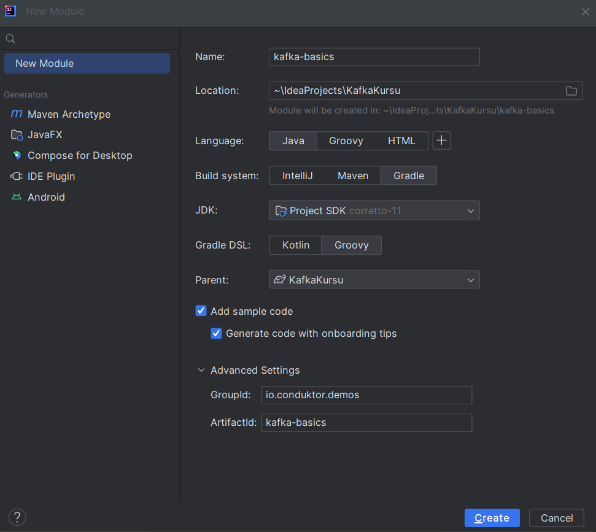
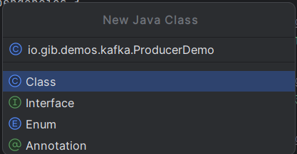

# Gradle ile Java Projesi
Bu derste Java programlama dili kullanarak bir Kafka Cluster veri alis-verisi entegrasyonu nasil yapildigini ogrenecegiz.

IntelliJ IDEA > New Project
 - **Proje ismi:** KafkaKursu
 - **Dil:** Java
 - **Build System:** Gradle
 - **JDK:** Corretto-11
 - **GroupId:** io.gib.demos
 - **ArtifactId:** KafkaKursu



**Create - Olustur**. Olusan projede **src** klasorunu silip kendi klasorumuzu olusturalim. (Opsiyonel)
Proje ismi yazan **ilk bastaki klasore** sag tiklayip **yeni modul** olusturalim. Ismine `kafka-basics` verip modul olusturalim.



### kafka-basics > build.gradle dosyasi ve Dependency ler
1. Apache Kafka
https://mvnrepository.com/artifact/org.apache.kafka
buradan **3.6.0** versiyonu **Gradle (short)** kismini kopyalayalim.
```java
// https://mvnrepository.com/artifact/org.apache.kafka/kafka-clients
implementation 'org.apache.kafka:kafka-clients:3.6.0'
```
2. SLF4J API
https://mvnrepository.com/artifact/org.slf4j/slf4j-api
buradan **1.7.36** verisyonu **Gradle (short)** kismini kopyalayalim.
```java
// https://mvnrepository.com/artifact/org.slf4j/slf4j-api
implementation 'org.slf4j:slf4j-api:1.7.36'
```
3. SLF4J Simple Provider
https://mvnrepository.com/artifact/org.slf4j/slf4j-api
buradan **1.7.36** verisyonu **Gradle (short)** kismini kopyalayalim.
```java
// https://mvnrepository.com/artifact/org.slf4j/slf4j-simple  
implementation 'org.slf4j:slf4j-simple:1.7.36'
```
4. **Test Dependency** lere ihtiyacimiz yok. Silebiliriz. (Opsiyonel)

build.gradle dosyasi son hali:
```gradle
plugins {  
  id 'java'  
}  
  
group = 'io.gib.demos'  
version = '1.0-SNAPSHOT'  
  
repositories {  
  mavenCentral()  
}  
  
dependencies {  
  // https://mvnrepository.com/artifact/org.apache.kafka/kafka-clients  
  implementation 'org.apache.kafka:kafka-clients:3.6.0'  
  
  // https://mvnrepository.com/artifact/org.slf4j/slf4j-api  
  implementation 'org.slf4j:slf4j-api:1.7.36'  
  
  // https://mvnrepository.com/artifact/org.slf4j/slf4j-simple  
  implementation 'org.slf4j:slf4j-simple:1.7.36'  
  
}  
  
test {  
  useJUnitPlatform()  
}
```
- Yeni dependency lerin projeye eklenmesi icin **Pull dependency** yapalim.

- Pull dependecy yaptiktan sonra solda **external libraries** kisminda kafka ve diger dependency leri gorebiliriz.

- Java uygulamamizi build etmeden once Conduktor Console uzerinden cluster da `demo_java` adli bir topic olusturalim.

- **kafka-basics > src > main > java klasoru** sag tus ile yeni `java class` olusturalim.
isim: **io.gib.demos.kafka.ProducerDemo**



```java
package io.gib.demos.kafka;  
  
import org.apache.kafka.clients.producer.KafkaProducer;  
import org.apache.kafka.clients.producer.ProducerConfig;  
import org.apache.kafka.clients.producer.ProducerRecord;  
import org.apache.kafka.common.serialization.StringSerializer;  
import org.slf4j.Logger;  
import org.slf4j.LoggerFactory;  
  
import java.util.Properties;  
  
public class ProducerDemo {  
    private static final Logger log = LoggerFactory.getLogger(ProducerDemo.class);  
  
    public static void main(String[] args) {  
      log.info("I am a Kafka Producer");  
  
      var props = new Properties();  
      //props.put("bootstrap.servers", "127.0.0.1:9092");  
      props.put("bootstrap.servers", "creative-dove-13738-us1-kafka.upstash.io:9092");  
      props.put("sasl.mechanism", "SCRAM-SHA-256");  
      props.put("security.protocol", "SASL_SSL");  
      props.put("sasl.jaas.config", "org.apache.kafka.common.security.scram.ScramLoginModule required username=\"Y3JlYXRpdmUtZG92ZS0xMzczOCQ27m3t0uKybSUVYz1Ghp8QdUARiadQvV_7HPE\" password=\"YmRjMWRjNzItYWU0NS00N2U2LTgxYjEtZmFkMDM5Y2FjNDlm\";");  
      props.put("key.serializer", "org.apache.kafka.common.serialization.StringSerializer");  
      props.put("value.serializer", "org.apache.kafka.common.serialization.StringSerializer");  
  
      // create the producer  
      KafkaProducer<String, String> producer = new KafkaProducer<>(props);  
  
      // create a producer record  
      ProducerRecord<String, String> producerRecord =  
          new ProducerRecord<>("demo_java", "hello world");  
  
      // send data - asynchronous  
      producer.send(producerRecord);  
  
      // flush data - synchronous  
      producer.flush();  
      // flush and close producer  
      producer.close();  
    }  
}
```
Upstash | Conduktor Console | CLI uzerinden kontrol edelim.

```bash
kafka-console-consumer.sh --consumer.config playground.config --bootstrap-server creative-dove-13738-us1-kafka.upstash.io:9092 --topic demo_java --from-beginning
```