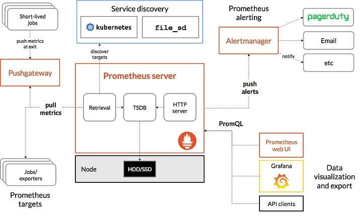

# Monitoring Prometheus | Grafana

## Prometheus

Açık kaynak kodlu bir sistem izleme aracı olan Prometheus, ölçülen verileri depolamak ve sorgulamak için zaman serileri veritabanı kullanır.



### Temel bazı özellikleri

- **Metrik** adı ve anahtar/değer çiftleriyle tanımlanan **zaman serisi** verileriyle çok boyutlu bir veri modeli sunar
- **PromQL** dili ile çok boyutluluktan yaralanma imkânı sağlar. PromQL read-only bir sorgulama dilidir.
- Veri toplama işlemlerini HTTP üzerinden **pull metodu** ile yapar
- Veri gönderme işlemlerini de ara bir katman yardımıyla **push metodu** ile yapar
- Hedefleri **service discovery** veya **statik** konfigürasyon ile yapabilir
- Çoklu grafik modu ve gösterge tablosu vardır
- Distributed yapıyı desteklemez **tek sunucuda** çalışır
- **Alertmanager** adında dahili uyarı sistemi vardır

### job/exporters

Prometehus metric’leri pull metodu ile kendisi target node’lardan toplar. Target’lar push yapmazlar.

### pushgateways

Bazı metric’ler pull metodu ile toplanmaya elverişli olmayabilir bu gibi durumlarda bu metod kullanılır. Pull yapılabilen ara katman olarak çalışır.

## Grafana

Açık kaynak kodlu bir görselleştirme aracı olan Grafana, farklı veri kaynaklarından (ör. Prometheus, InfluxDB, Elasticsearch) gelen verileri görselleştirmek için kullanılır. Grafana, çeşitli görselleştirme türleri ve anlık alarm özellikleri gibi işlevler sunar. 

## Hands-on

- asagidaki github reposunu lokale cekelim.

`git clone https://github.com/streamthoughts/kafka-monitoring-stack-docker-compose.git`

- docker compose komutunu girelim

```bash
cd kafka-monitoring-stack-docker-compose
docker-compose -f zk-kafka-single-node-stack.yml up
```

- github sayfasinda bulunan kodlar ile topic, producer ve consumer olusturalim. ( farkli terminallerde )

```bash
docker exec -it kafka101 \                       
kafka-topics \
--create \
--partitions 6 \
--replication-factor 1 \
--topic demo-topic \
--bootstrap-server kafka101:29092
```

```bash
docker exec -it kafka101 \                     
kafka-producer-perf-test \
--throughput 500 \
--num-records 100000000 \
--topic demo-topic \
--record-size 100 \              
--producer-props bootstrap.servers=kafka101:29092
```

```bash
docker exec -it kafka101 \                   
kafka-consumer-perf-test \
--messages 100000000 \
--timeout 1000000 \      
--topic demo-topic \
--reporting-interval 1000 \      
--show-detailed-stats \                          
--bootstrap-server kafka101:29092
```

- localhost:3000 den grafana UI baglanalim. Yeni bir data source `http://prometheus:9090` olusturalim.  Yeni bir dashboard ekleyelim. dashboard ID: `14505`