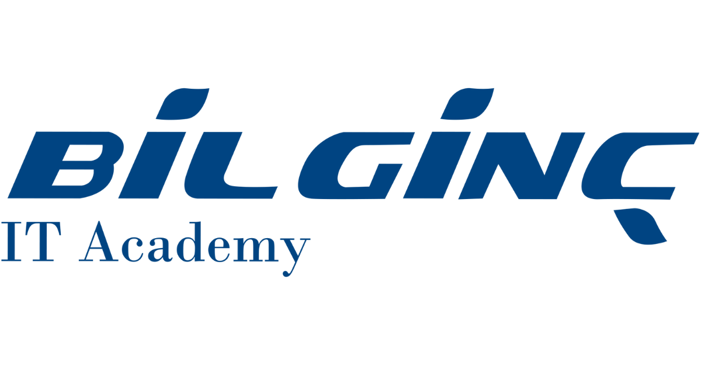

# APACHE KAFKA

## Bu Kursta Neler Ogreneceksiniz?

1. Kafka nedir? IT alaninda ne gibi cozumler saglar? Ornek Kullanim alanlari nelerdir? (Teori)

2. Temel Teorik Bilgiler
	-  Topics
	- Partitions
	- Offsets
	- Producers
	- Consumers - Consumer Groups
	- Brokers
	- Topic Replication
	- Producer ACK
	- Zookeeper | Kafka Kraft	

3. Conduktor tanıtımı | Web UI | UPStash | Aiven

4. Kafka CLI komutları kullanımı

5. Java API ile uygulama geliştirme

6. Senaryo tabanli Kafka Uygulamasi incelemesi

7. Kafka Connect

8. Kafka Streams

9. Örnek senaryolar

10. Kafka Yonetim Araçları – ACL – Service Accounts

11. Prometheus ve Grafana ile monitoring

  

## Gerekli Kurulumlar

• VSCode https://code.visualstudio.com/

• IntelliJ IDEA ( Community Edition ) https://www.jetbrains.com/idea/download/?section=windows

• Java 11 JDK Corretto https://docs.aws.amazon.com/corretto/latest/corretto-11-ug/downloads-list.html

• WSL2 ( Windows Subsystem for Linux) https://learn.microsoft.com/tr-tr/training/modules/wsl-introduction/install-and-setup

• Docker Desktop https://www.docker.com/products/docker-desktop/

## DERS PROGRAMI

### I. Gün
|Ders|Saat| |Konu|
|:----|:----|:----|:----|
|1. Ders|9.30-10.15|:|Kafka nedir? IT alaninda ne gibi cozumler saglar? Ornek Kullanim alanlari nelerdir?|
|2. Ders|10.30-11.15|:|Topics | Partitions | Offsets | Producers | Consumers - Consumer Groups|
|3. Ders|11.30-12.30|:|Brokers | Topic Replication |Producer ACK | Zookeeper/Kafka Kraft|
|ÖĞLE ARASI| | | |
|4. Ders|13.30-14.15|:|Gerekli Kurulumlar|
|5. Ders|14.30-15.15|:|Conduktor tanıtımı-kurulum-docker | Web UI | UPStash|
|6. Ders|15.30-16.30|:|Recap|

### II. Gün

|Ders|Saat| |Konu|
|:----|:----|:----|:----|
|1. Ders|9.30-10.15|:|Kafka CLI komutları kullanımı - I|
|2. Ders|10.30-11.15|:|Kafka CLI komutları kullanımı – II|
|3. Ders|11.30-12.30|:|Java API ile uygulama geliştirme – I|
|ÖĞLE ARASI| | | |
|4. Ders|13.30-14.15|:|Java API ile uygulama geliştirme – II|
|5. Ders|14.30-15.15|:|Java API ile uygulama geliştirme – III|
|6. Ders|15.30-16.30|:|Recap – Troubleshoot|

### III. Gün

|Ders|Saat| |Konu|
|:----|:----|:----|:----|
|1. Ders|9.30-10.15|:|Senaryo tabanli Kafka Uygulamasi incelemesi|
|2. Ders|10.30-11.15|:|Senaryo tabanli Kafka Uygulamasi incelemesi|
|3. Ders|11.30-12.30|:|Kafka Connect  - Kafka Streams|
|ÖĞLE ARASI| | | |
|4. Ders|13.30-14.15|:|Kafka Yönetim Araçları – ACL – Service Account|
|5. Ders|14.30-15.15|:|Prometheus ve Grafana ile İzleme|
|6. Ders|15.30-16.30|:|Senaryo Örneklerı - Recap - Kapanış|
  

### Ders Materyalleri

• Apache Kafka Official Documentation

• Learn Kafka with Conduktor

• Upstash: Serverless Data for Kafka

• Aiven Cloud provider

• Docker | Conduktor

• Kafkademy | Conduktor

### Kullanilacak Repolar

• https://github.com/Golge/LearningKafka.git

• https://github.com/conduktor/kafka-stack-docker-compose.git

• https://github.com/conduktor/kafka-beginners-course.git
